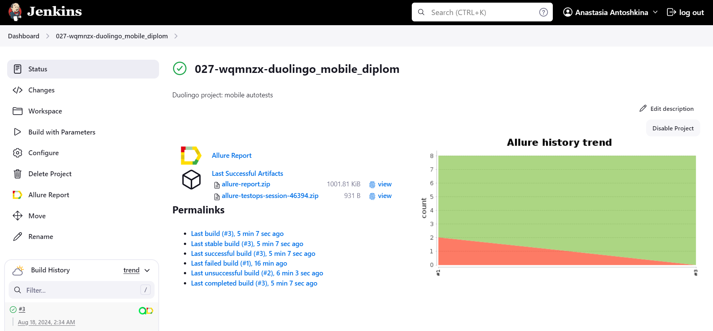
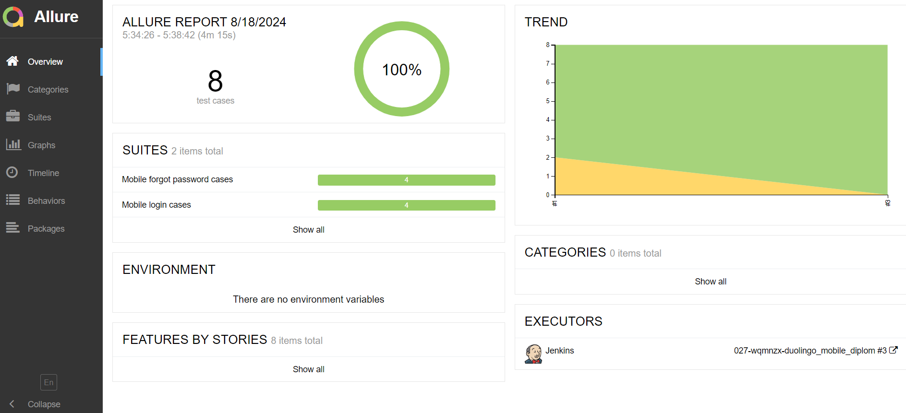
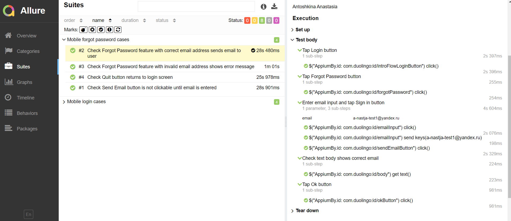
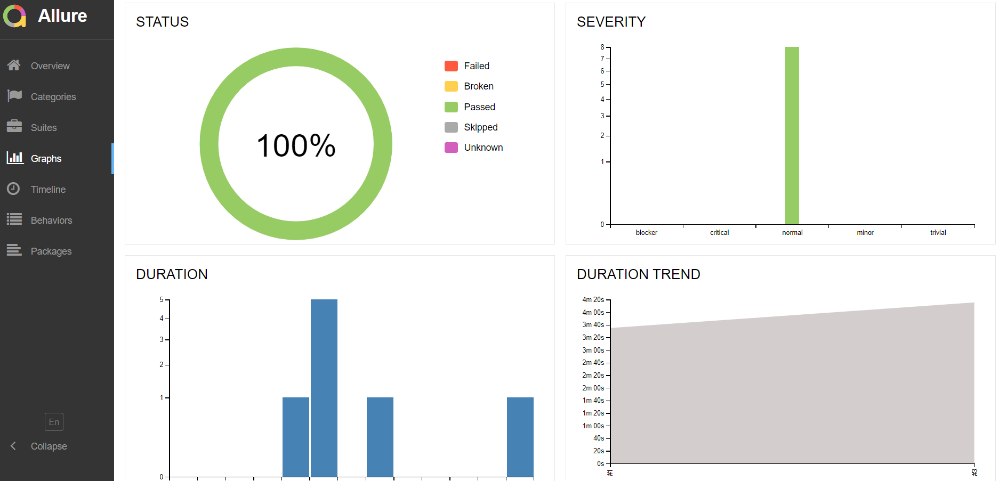
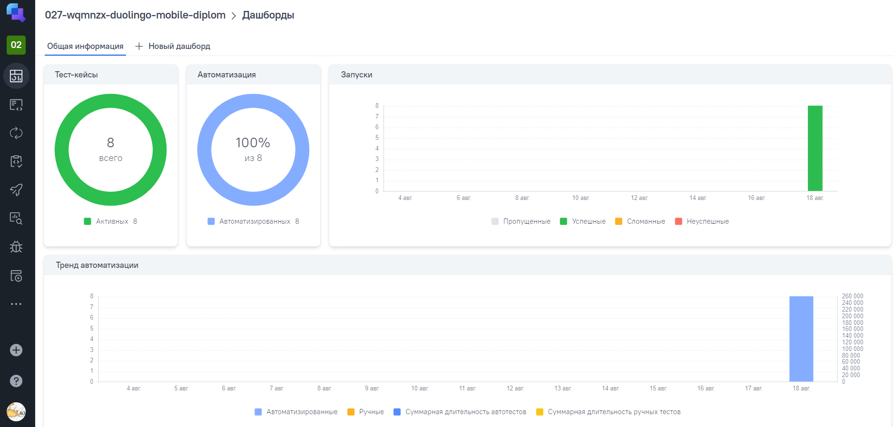
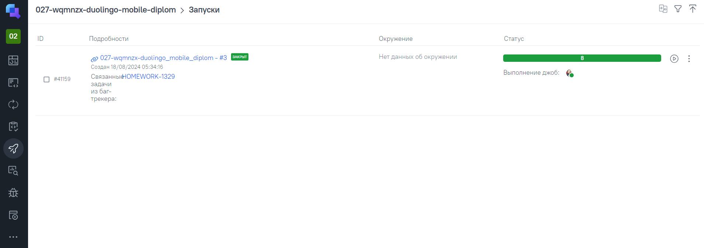
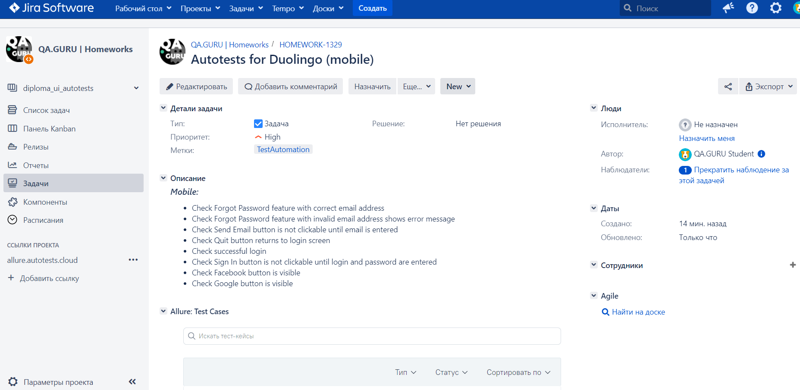
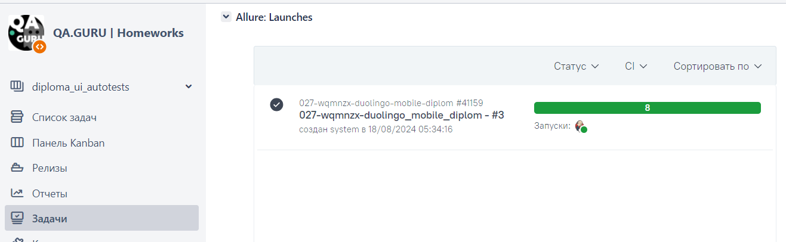
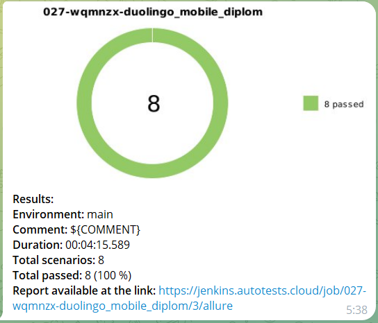

# Automation project for [Duolingo app](https://www.duolingo.com/) [](https://www.duolingo.com/)
>With more than 500 million learners, Duolingo has the world's largest collection of language-learning data at its fingertips. This allows us to build unique systems, uncover new insights about the nature of language and learning, and apply existing theories at scales never before seen.

## :scroll: Table of contents
- [Technology stack](#computer-technology-stack)
- [Automated tests](#heavy_check_mark-automated-tests)
- [Jenkins build](#-jenkins-build)
- [Allure report](#-allure-report)
- [Allure TestOps](#-allure-testOps)
- [Jira](#-jira)
- [Telegram notifications](#-telegram-notifications)
- [Test execution](#movie_camera-test-execution)

## :computer: Technology stack
<p align="center">
<a href="https://www.jetbrains.com/idea/"></a> 
<a href="https://www.java.com/"></a>
<a href="https://selenide.org/"></a>
<a href="https://appium.io/"></a> 
<a href="https://github.com/allure-framework/allure2"></a>
<a href="https://gradle.org/"></a> 
<a href="https://junit.org/junit5/"></a> 
<a href="https://rest-assured.io/"></a> 
<a href="https://qameta.io/"></a> 
<a href="https://github.com/"></a> 
<a href="https://www.browserstack.com/"></a> 
<a href="https://developer.android.com"></a>
<a href="https://www.jenkins.io/"></a>
<a href="https://telegram.org/"></a> 
<a href="https://www.atlassian.com/ru/software/jira"></a>
</p>

Automated tests:
- Implemented in ```Java``` language
- ```Gradle``` is used as a collector
- The frameworks used are ```JUnit 5``` and ```Selenide```
- For making flexible tests ```Owner``` technology is used
- ```Faker``` is used to generate data
- ```Lombok``` is used for models in API tests
- ```Jenkins``` is used for remote launch
- Integration with ```Jira``` and ```Allure TestOps``` created
- ```Allure Report``` is generated for the build
- Sending ```Telegram``` notifications about results is configured
- ```Browserstack``` is used to run mobile tests remotely
- To run mobile tests locally on emulator or real device, ```Appium``` and ```Android Studio``` are used


Based on results of passing autotests, an Allure report is generated. Contents of the report:
* Test steps
* Screenshot of the page at the last step
* Source code
* Browser console logs
* Test execution video

## :heavy_check_mark: Automated tests

### *Mobile:*
- Check Forgot Password feature with correct email address
- Check Forgot Password feature with invalid email address shows error message
- Check Send Email button is not clickable until email is entered
- Check Quit button returns to login screen
- Check successful login
- Check Sign In button is not clickable until login and password are entered
- Check Facebook button is visible
- Check Google button is visible

##  [Jenkins build](https://jenkins.autotests.cloud/job/027-wqmnzx-duolingo_mobile_diplom/)
[](https://jenkins.autotests.cloud/job/027-wqmnzx-duolingo_mobile_diplom/)
### *Launch commands*

***Locally:***

By default, autotests run remotely in Browserstack, and there is no need to additionally configure local devices and Appium server.
To run autotests on local devices:
1. Launch Appium Server, Appium Inspector and a real device/emulator on which the tests will be run.
2. Update device settings in ```resources/real.properties``` or ```resources/emulation.properties``` files.

To run all mobile autotests locally on a real device (need login and password to log in to Duolingo account):
```bash
gradle clean test -DdeviceHost=real -Dlogin='' -Dpassword=''
or
gradle clean mobile -DdeviceHost=real -Dlogin='' -Dpassword=''
```

To run all mobile autotests locally on an emulator:
```bash
gradle clean test -DdeviceHost=emulation -Dlogin='' -Dpassword=''
or
gradle clean mobile -DdeviceHost=emulation -Dlogin='' -Dpassword=''
```

To run mobile autotests with tag <code>login</code> (or <code>forgot</code>):
```bash
gradle clean login -Dlogin='' -Dpassword=''
gradle clean forgot -Dlogin='' -Dpassword=''
```

***Via Jenkins:***
Tests are launched in Browserstack by default:
```bash
clean 
${TASK}
-"Dlogin=${LOGIN}"
-"Dpassword=${PASSWORD}"
```

To start the build:
1. Go to the build
2. Click on ```Build```

##  [Allure report](https://jenkins.autotests.cloud/job/027-wqmnzx-duolingo_mobile_diplom/allure/)
After the build is completed the icons [](https://jenkins.autotests.cloud/job/027-wqmnzx-duolingo_mobile_diplom/allure/) and [](https://allure.autotests.cloud/project/4389/dashboards) are displayed in ```Build History```.
When clicking on the [](https://jenkins.autotests.cloud/job/027-wqmnzx-duolingo_mobile_diplom/allure/) icon, a page with a generated html report and test documentation opens. When clicking on the [](https://allure.autotests.cloud/project/4389/dashboards) icon a project page in Allure TestOps opens.
### *Main report page*
[](https://jenkins.autotests.cloud/job/027-wqmnzx-duolingo_mobile_diplom/allure/)

### *Test cases*
[](https://jenkins.autotests.cloud/job/027-wqmnzx-duolingo_mobile_diplom/allure/#suites)

### *Graphs*
[](https://jenkins.autotests.cloud/job/027-wqmnzx-duolingo_mobile_diplom/allure/#graph)

##  [Allure TestOps](https://allure.autotests.cloud/project/4389/dashboards)

```Allure TestOps``` is a test management platform that provides a comprehensive set of tools for organizing, executing, and analyzing tests in projects.

### *Dashboard*
Summary information about the current testing status of the project:
[](https://allure.autotests.cloud/project/4389/dashboards)

### *Launches*
This section displays test runs launched from Jenkins and Allure TestOps:
[](https://allure.autotests.cloud/project/4389/launches)

##  [Jira](https://jira.autotests.cloud/browse/HOMEWORK-1329)

Integration of Jira and Allure TestOps allows to link tasks and test documentation, which helps manage product quality effectively.
### *Jira task*
[](https://jira.autotests.cloud/browse/HOMEWORK-1329)

### *Allure: Launches*
[](https://jira.autotests.cloud/browse/HOMEWORK-1329)

##  Telegram notifications

After the build is completed, a special bot created in ```Telegram``` automatically processes and sends a message with a test run report.

[]()

## :movie_camera: Test execution

[]()
